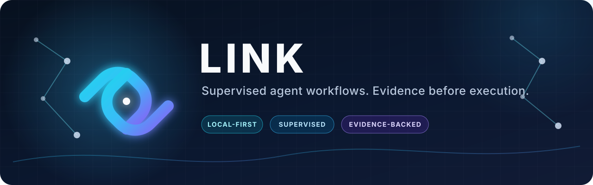
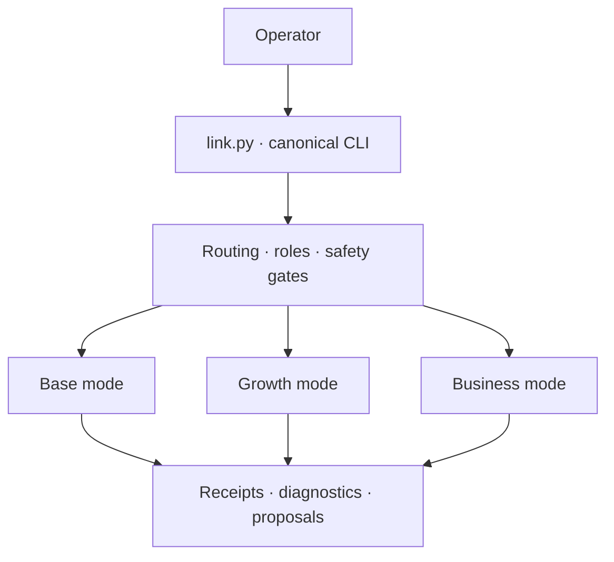

<p align="center">
  
</p>

<p align="center">
  <a href="https://github.com/TenchiNeko/Link/actions/workflows/ci.yml"></a>
  
  <a href="LICENSE"></a>
  
  
</p>

<p align="center"><strong>A local-first Python toolkit for agent workflows that keeps routing, approvals, and evidence visible.</strong></p>

<p align="center">
  <a href="#why-link">Why Link</a> ·
  <a href="#quick-start">Quick start</a> ·
  <a href="#architecture">Architecture</a> ·
  <a href="#cli-tour">CLI tour</a> ·
  <a href="#development">Development</a>
</p>

Link brings model routing, bounded worker roles, approval gates, execution receipts, diagnostics, and research-derived proposals behind one inspectable command-line interface. It is designed for supervised work on your own machine: preview first, make state changes explicitly, and leave evidence behind.

> [!IMPORTANT]
> Link is under active development. Its CLI and deterministic smoke suites are functional, but packaged releases and long-term compatibility guarantees are not available yet. Treat it as an engineering toolkit, not an unattended production service.

## Why Link?

Agent workflows become difficult to trust when routing is implicit, permissions are broad, and results disappear into chat history. Link makes those boundaries concrete:

| Principle | What it means in Link |
| --- | --- |
| **Local-first** | Loopback model endpoints are the default; cloud-advisor paths require an explicit opt-in. |
| **Supervised** | Writes, patch application, approvals, and workspace actions live behind named commands and guards. |
| **Inspectable** | Roles, routes, configuration, receipts, and proposals use explicit data structures. |
| **Evidence-backed** | Research intake produces sourced observations and upgrade proposals before implementation. |
| **Composable** | A canonical CLI coordinates shared core services and focused operating modes. |

## Operating modes

| Mode | Purpose | Default boundary |
| --- | --- | --- |
| **Base** | Plan, route, patch, verify, diagnose, and produce execution evidence | Supervised execution |
| **Growth** | Inspect user-supplied research and turn observations into Link-native upgrade proposals | Read-only intake and previews |
| **Business** | Build governed work orders and business-development or operations previews | Preview and approval gates |

The modes share one safety and routing foundation while keeping their domain-specific configuration separate.

## Quick start

### Requirements

- Python 3.11+
- Git
- A POSIX-compatible shell for the examples below

### Install and verify

```bash
git clone https://github.com/TenchiNeko/Link.git
cd Link

python3 -m venv .venv
source .venv/bin/activate
python3 -m pip install -r requirements.txt

python3 link.py self-test
python3 link.py config
```

No provider credential or running model is required for the CLI smoke checks.

### Explore the toolkit

```bash
python3 link.py modes          # inspect the three operating modes
python3 link.py roles          # list bounded worker profiles
python3 link.py route --help   # inspect deterministic routing
python3 link.py doctor         # run local diagnostics
python3 link.py growth --help  # explore research-to-proposal workflows
```

## Architecture



The architectural rule is deliberate: research and planning may generate evidence and proposals, but implementation remains a separate, human-approved step.

| Path | Responsibility |
| --- | --- |
| `link.py` | Canonical command dispatcher |
| `link_core/` | Routing, roles, safety, receipts, diagnostics, and control-plane contracts |
| `link_modes/` | Growth and Business operating modes |
| `factory/` | Reusable team, approval, and workflow helpers |
| `configs/` | Checked-in model-routing and team defaults |
| `tools/research/` | Link-native inspection utilities |
| `tests/` | Deterministic standalone smoke suites |

Read the [architecture guide](docs/ARCHITECTURE.md) for the complete module and safety boundaries.

## CLI tour

| Command | Use it to |
| --- | --- |
| `status` | Inspect configured local runtime, model, and web endpoints |
| `doctor` | Run the diagnostics dashboard |
| `agents` / `roles` | Inspect agent sources and bounded worker profiles |
| `route` | Preview deterministic pre-run routing |
| `engine` | Enter the supervised run engine |
| `research` | Inspect a user-supplied local research target |
| `governance` | Preview unified governance state |
| `control-plane` | Inspect control-plane health and stages |
| `self-test` | Verify canonical architecture contracts |
| `healthcheck` | Run the broader Link healthcheck |

Run `python3 link.py --help` for the complete command list and `python3 link.py <command> --help` for command-specific options.

## Configuration

Safe defaults live in [`configs/models.yaml`](configs/models.yaml) and [`configs/teams/`](configs/teams/). Machine-specific endpoints, model IDs, and credentials belong in the environment or a local `.env` file, which Git ignores.

```bash
cp .env.example .env
python3 link.py config
```

Common variables:

- `OLLAMA_HOST` or `OLLAMA_BASE_URL` — status-check endpoint
- `OLLAMA_PRIMARY_URL` — primary OpenAI-compatible local endpoint
- `LINK_LOCAL_FAST_MODEL` and `LINK_LOCAL_DEEP_MODEL` — local routing choices
- `LINK_ALLOW_OPENROUTER_ADVISOR=1` — explicit cloud-advisor opt-in
- `OPENROUTER_API_KEY` or `LINK_OPENROUTER_API_KEY` — optional advisor credential

See the [configuration guide](docs/CONFIGURATION.md) and [`.env.example`](.env.example) for the supported surface and safe placeholders.

## Safety model

- Preview and read-only behavior is the default for research and planning paths.
- Provider use, writes, approvals, patch application, and workspace lifecycle actions are explicit.
- External research repositories and downloaded archives are inputs, not bundled dependencies.
- Runtime receipts, local agent state, credentials, browser profiles, and model artifacts stay out of source control.
- Reporting paths are designed to redact sensitive values.

See [SECURITY.md](SECURITY.md) for reporting guidance. Never place a live provider key in source, YAML, documentation, fixtures, or issues.

## Development

```bash
make install
make test
make lint
make typecheck
```

The test files are deterministic standalone smoke suites rather than pytest-discovered unit tests. `make test` invokes the supported suites directly. Some source-archive integration checks require private, user-supplied inputs and remain opt-in.

## Contributing

Contributions should be focused, reproducible, and honest about what was tested. Start with [CONTRIBUTING.md](CONTRIBUTING.md), and use the repository's issue and pull-request templates when proposing a change.

## License

Link is available under the [MIT License](LICENSE).
